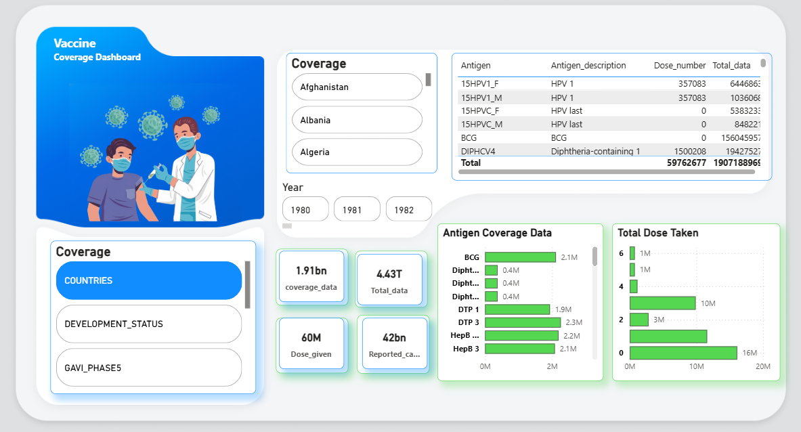
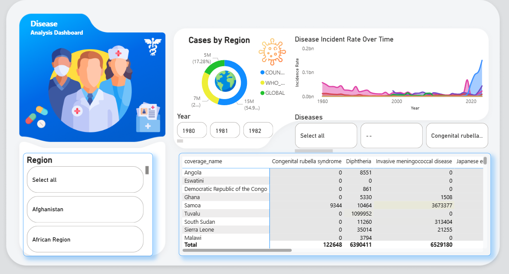
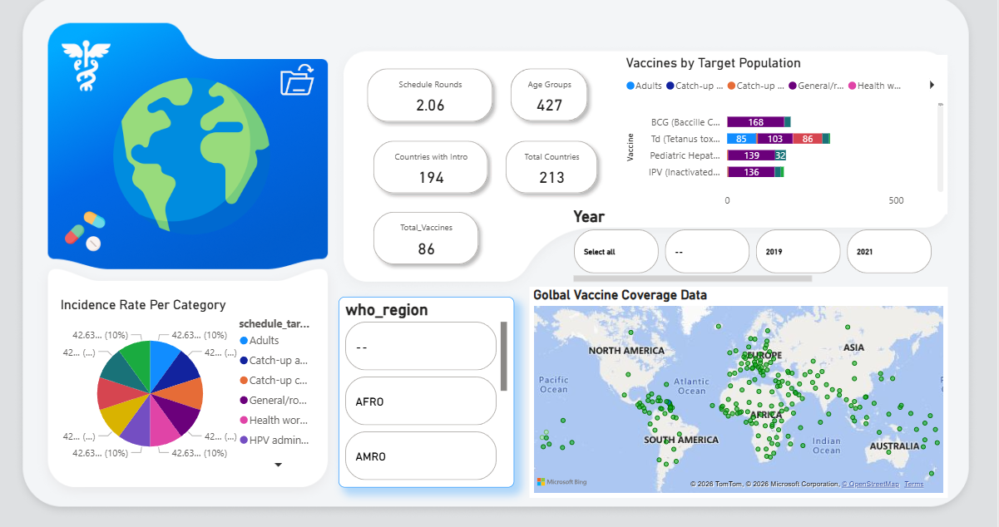

# Vaccine Data Analysis

Data cleaning and analysis project for global vaccine coverage and disease incidence data.

## Project Structure

```
Vaccine_Data_Analysis/
├── raw/                    # Raw Excel files
├── processed/              # Cleaned Excel files
├── notebook/               # Jupyter notebooks for data cleaning
├── python_to_sql.py        # Load data to MySQL
├── requirements.txt        # Python packages
└── README.md
```

## Setup

1. Install dependencies:
```bash
pip install -r requirements.txt
```

2. Load data to MySQL:
```bash
python python_to_sql.py
```

## Data Files

- **coverage-data.xlsx** - 399,858 vaccine coverage records
- **incidence-rate-data.xlsx** - 84,945 disease incidence records
- **reported-cases-data.xlsx** - 84,869 reported disease cases
- **vaccine-introduction-data.xlsx** - 43,589 vaccine introduction records
- **vaccine-schedule-data.xlsx** - 7,433 vaccination schedule records

## Notebooks

- `coverage_data.ipynb` - Clean coverage data
- `Incidence_rate.ipynb` - Clean incidence data
- `report_class.ipynb` - Clean reported cases
- `vaccine_introduction.ipynb` - Clean introduction data
- `vaccine_schedule.ipynb` - Clean schedule data

## Database

**MySQL Database:** `vaccine_db`

**Configuration:**
```python
host = 'localhost'
database = 'vaccine_db'
user = 'root'
password = 'yourpassword'
```

## Power BI Dashboards

4 interactive dashboards analyzing vaccine data:

1. **Homepage** - Global metrics and navigation
2. **Coverage Dashboard** - Vaccine coverage statistics
3. **Disease Analysis** - Disease incidence trends
4. **Global Coverage** - Geographic visualization

### Dashboard Screenshots

**Homepage - Vaccine Analysis Dashboard**


**Vaccine Coverage Dashboard**


**Disease Analysis Dashboard**


**Global Coverage Dashboard**


### Video Demo

https://github.com/rahul22106/Vaccine_Data_Analysis/blob/main/powerbi.mp4

*Interactive Power BI dashboard demonstration showing all 4 dashboards and navigation*

## License

MIT License - Copyright (c) 2026 Rahul Kumar Mishra